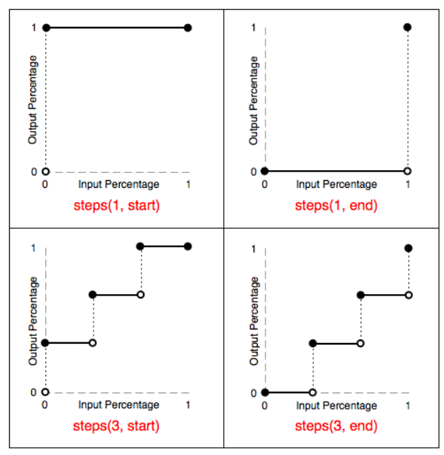

---
tags:
- css
abstract: 教你制作一个赛博朋克风的按钮
---

# 来一个赛博朋克故障风的按钮

<TagGroup/>

前两天在b站刷到一个教你制作赛博朋克风的按钮的视频，附上视频链接 [纯CSS制作赛博朋克2077“故障风”按钮](https://www.bilibili.com/video/BV15A411s7cX) 。里面的一些技术不常用但是酷炫，这里记录一下。

首先直接来看demo及其代码，然后我会一步步的解析代码和其中的要点。

::: demo-code
<template>
  <div class="cyberpunk-wrap">
    <link href="https://fonts.font.im/css?family=Do+Hyeon" rel="stylesheet">
    <button class="cyberpunk">AVALIABLE NOW</button>
  </div>
</template>

<style>
.cyberpunk-wrap {
  display: flex;
  justify-content: center;
  align-items: center;
  min-height: 400px;
  background-color: #f8f005;
}

.cyberpunk,.cyberpunk::after {
  position: relative;
  width: 380px;
  height: 86px;
  font-size: 36px;
  background: linear-gradient(45deg, transparent 5%, #ff013c 5%);
  border: 0;
  color: #fff;
  letter-spacing: 3px;
  line-height: 88px;
  box-shadow: 6px 0px 0 #00e6f6;
  outline: transparent;
  font-family: 'Do Hyeon', sans-serif;
  cursor: pointer;
}

.cyberpunk::after {
  --slice-0: inset(50% 50% 50% 50%);
  --slice-1: inset(80% -6px 0 0);
  --slice-2: inset(50% -6px 30% 0);
  --slice-3: inset(10% -6px 85% 0);
  --slice-4: inset(40% -6px 43% 0);
  --slice-5: inset(80% -6px 5% 0);
  
  content: 'AVALIABLE NOW';
  display: block;
  position: absolute;
  top: 0;
  left: 0;
  right: 0;
  bottom: 0;
  background: linear-gradient(45deg, transparent 3%, #00e6f6 3%, #00e6f6 5%, #ff013c 5%);
  text-shadow: -3px -3px 0px #f8f005, 3px 3px 0px #00e6f6;
  clip-path: var(--slice-0);
}

.cyberpunk:hover::after {
  animation: 1s glitch steps(2, end);
}

@keyframes glitch {
  0% {
    clip-path: var(--slice-1);
    transform: translate(-20px, -10px);
  }
  
  10% {
    clip-path: var(--slice-3);
    transform: translate(10px, 10px);
  }
  
  20% {
    clip-path: var(--slice-1);
    transform: translate(-10px, 10px);
  }
  
  30% {
    clip-path: var(--slice-3);
    transform: translate(0px, 5px);
  }
  
  40% {
    clip-path: var(--slice-2);
    transform: translate(-5px, 0px);
  }
  
  50% {
    clip-path: var(--slice-3);
    transform: translate(5px, 0px);
  }
  
  60% {
    clip-path: var(--slice-4);
    transform: translate(5px, 10px);
  }
  
  70% {
    clip-path: var(--slice-2);
    transform: translate(-10px, 10px);
  }
  
  80% {
    clip-path: var(--slice-5);
    transform: translate(20px, -10px);
  }
  
  90% {
    clip-path: var(--slice-1);
    transform: translate(-10px, 0px);
  }
  
  100% {
    clip-path: var(--slice-1);
    transform: translate(0);
  }
}
</style>
:::

## 画个按钮

来简单画一个静立在黄色面板里的缺口红色按钮。

首先是 html

```html
<button>AVALIABLE NOW</button>
```

然后是样式

```css
body {
  display: flex;
  justify-content: center;
  align-items: center;
  min-height: 100vh;
  background-color: #f8f005;
}

button {
  position: relative;
  width: 380px;
  height: 86px;
  font-size: 36px;
  background: linear-gradient(45deg, transparent 5%, #ff013c 5%);
  border: 0;
  color: #fff;
  letter-spacing: 3px;
  line-height: 88px;
  box-shadow: 6px 0px 0 #00e6f6;
  outline: transparent;
}
```

效果如图


### 知识要点

#### linear-gradient() 函数

为了实现按钮左下角缺口，使用了 `linear-gradient()` 函数，该函数用于创建多种颜色渐变的图片。使用方式为 `linear-gradient(<direction>, <color-stop1>, <color-stop2>, ...);`

- `direction`：角度，顺时针旋转

- `color-stop1`：分为 `color` 和 `stop`，第二个值 `stop` 是颜色起止的位置，如果相邻两个颜色起止位置一样，则两个颜色之间为硬朗的分界线（如按钮的 transparent 和 红色 的起止位置都是 5%）

#### box-shadow

右边框蓝色阴影，使用方式为 `box-shadow: <h-shadow> <v-shadow> <blur> <spread> <color> <inset>;`

- `h-shadow`：必需的。水平阴影的位置。允许负值

- `v-shadow`：必需的。垂直阴影的位置。允许负值

- `blur`：可选。模糊距离

- `spread`：可选。阴影的大小

- `color`：可选。阴影的颜色

- `inset`：可选。从外层的阴影（开始时）改变阴影内侧阴影

## 故障按钮

接下来使用伪元素增加一个故障风的按钮，基础样式与原button一致。

```css
button,
,button::after {
  /* button 的样式 */
}

button::after {
  content: 'AVALIABLE NOW';
  display: block;
  position: absolute;
  top: 0;
  left: 0;
  right: 0;
  bottom: 0;
  background: linear-gradient(45deg, transparent 3%, #00e6f6 3%, #00e6f6 5%, #ff013c 5%);
  text-shadow: -3px -3px 0px #f8f005, 3px 3px 0px #00e6f6;
}
```

效果如图


### 知识要点

#### text-shadow

这里使用文字阴影 `text-shadow` 实现了多重文字震颤的效果，使用方式为 `text-shadow: <h-shadow> <v-shadow> <blur> <color>;`

- `h-shadow`：必需。水平阴影的位置。允许负值

- `v-shadow`：必需。垂直阴影的位置。允许负值

- `blur`：可选。模糊的距离

- `color`：	可选。阴影的颜色

## 图形剪裁

接着就是设置动画要使用的剪裁图形变量了，这里会将伪元素故障按钮切成一个个长条形状，为后面动作闪现做准备

```css
button::after {
  --slice-0: inset(50% 50% 50% 50%);
  --slice-1: inset(80% -6px 0 0);
  --slice-2: inset(50% -6px 30% 0);
  --slice-3: inset(10% -6px 85% 0);
  --slice-4: inset(40% -6px 43% 0);
  --slice-5: inset(80% -6px 5% 0);

  /* ... */

  clip-path: var(--slice-0);
```

### 知识点

#### clip-path

使用 `clip-path` 可以将元素剪裁出自己想要的形状，用法为 `clip-path: <function>;`，可用函数：

- `inset(<top>, <right>, <bottom>, <left> round <top>, <right>, <bottom>, <left>)`：相对四条边距离裁剪

  - `<top>, <right>, <bottom>, <left>` 必需，可简写。是相对于对应边的距离

  - `round <top>, <right>, <bottom>, <left>` 可选。与 `border-radius` 用法相似

  - eg：`clip-path: inset(50% -6px 30% 0);`

- `url(<svg>)`：剪裁路径来自 SVG clipPath 元素

- `polygon(<x1> <y1>, <x2> <y2>, ...)`：多边形，指定每个裁剪路径上的点坐标

  - eg：`clip-path: polygon(0 0, 50% 0, 50% 100%, 0 100%)`

- `circle(<radius> at <x> <y>)`：圆形

  - `radius`：圆半径

  - `at <x> <y>`：圆心坐标

  - eg：`clip-path: circle(10px at 20px 10px)`

- `ellipse(<x-radius> <y-radius> at <x> <y>)`：椭圆形

  - `x-radius`：x轴半径

  - `y-radius`：y轴半径

  - `at <x> <y>`：圆心坐标

  - eg：`clip-path: ellipse(20px 10px at 20px 10px)`

#### var()

`var()` 函数可以使用 css 变量，css 变量只能使用在 css 属性的值上，不能设置为 css 属性名以及其他值。css 变量的声明方式为在 `{}` 代码块内声明 `--` 加变量名即可。例如：

```css
:root{
  --color: red;
}
div {
  color: var(--color);
}
```

## 制作动画

动画中随机出现上面剪裁好的故障按钮条，并用 `translate` 给故障按钮条一点位移

```css
button:hover::after {
  animation: 1s glitch steps(2, end);
}

@keyframes glitch {
  0% {
    clip-path: var(--slice-1);
    transform: translate(-20px, -10px);
  }
  
  10% {
    clip-path: var(--slice-3);
    transform: translate(10px, 10px);
  }
  
  20% {
    clip-path: var(--slice-1);
    transform: translate(-10px, 10px);
  }
  
  30% {
    clip-path: var(--slice-3);
    transform: translate(0px, 5px);
  }
  
  40% {
    clip-path: var(--slice-2);
    transform: translate(-5px, 0px);
  }
  
  50% {
    clip-path: var(--slice-3);
    transform: translate(5px, 0px);
  }
  
  60% {
    clip-path: var(--slice-4);
    transform: translate(5px, 10px);
  }
  
  70% {
    clip-path: var(--slice-2);
    transform: translate(-10px, 10px);
  }
  
  80% {
    clip-path: var(--slice-5);
    transform: translate(20px, -10px);
  }
  
  90% {
    clip-path: var(--slice-1);
    transform: translate(-10px, 0px);
  }
  
  100% {
    clip-path: var(--slice-1);
    transform: translate(0);
  }
}
```

### 知识点

#### steps()

`animation-timing-function` 属性中使用，可使动画达到不连续的效果，使用方法为 `steps(<number>, <position>)`

- `nunber`：必需。时间函数中间隔数量

- `position`：可选。`start` 或 `end`

`steps()` 函数刨析图




## 参考链接

- linear-gradient: https://www.runoob.com/cssref/func-linear-gradient.html

- box-shadow: https://www.runoob.com/cssref/css3-pr-box-shadow.html

- clip-path: https://www.zhangxinxu.com/wordpress/2014/12/css3-svg-clip-path/

- var: https://www.zhangxinxu.com/wordpress/2016/11/css-css3-variables-var/

- steps: https://www.w3cschool.cn/lugfe/lugfe-6vyb25zm.html
