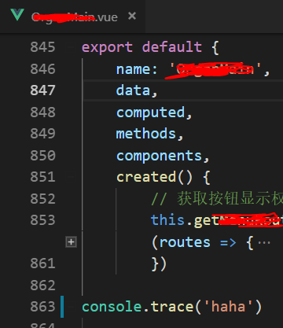
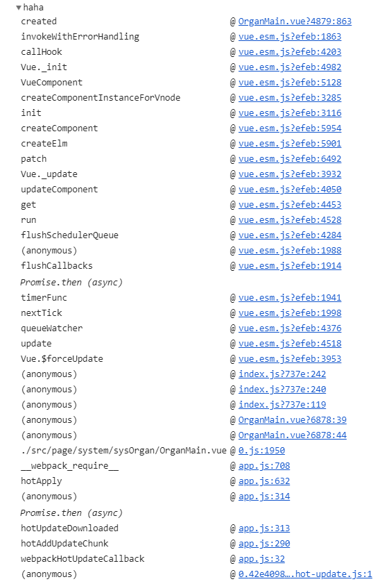

---
tags:
- js
abstract: 本文介绍5个用 console 来 debug 的技巧，包括trace、time、memory、count、group等
---

# console 的5个技巧

<TagGroup/>

最常用的 `console` 不外乎以下几种

- console.log()
- console.info()
- console.warn()
- console.error()

下面，讲5种其他实用的 `console` 技巧

## 1.console.trace()

可以追踪消息打印的来源

## 2.console.time() && console.timeEnd()

在需要计时的代码两头加入 `console.time() && console.timeEnd()` 即可打印出两次打印相隔的时间

## 3.console.memory

使用 `console.memory` 属性可以查看当前的内存的使用情况。

## 4.console.count()

在一段代码中使用 `console.count()` 来记录其执行的次数。执行一次 + 1。

## 5.console.group() & console.groupEnd()

使用console.group()和console.groupEnd()可以打印成组，甚至可以嵌套层级。

<Gitalk/>