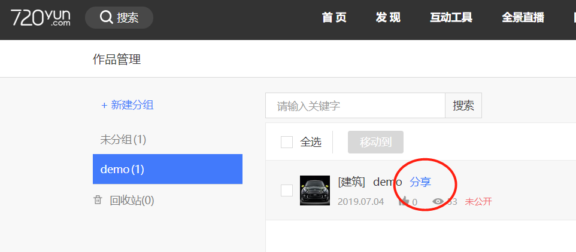
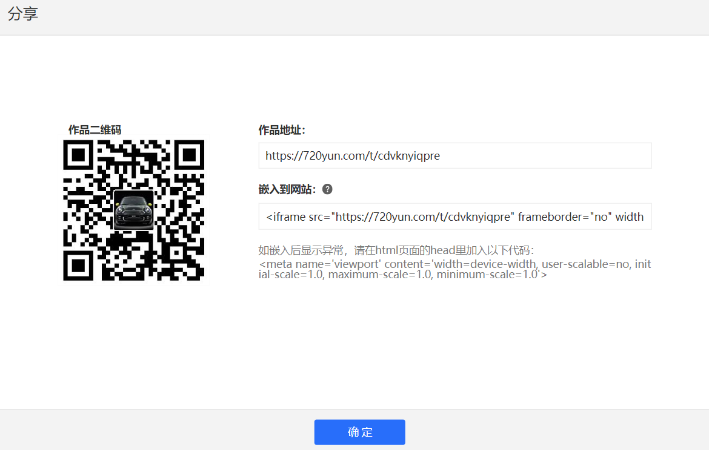
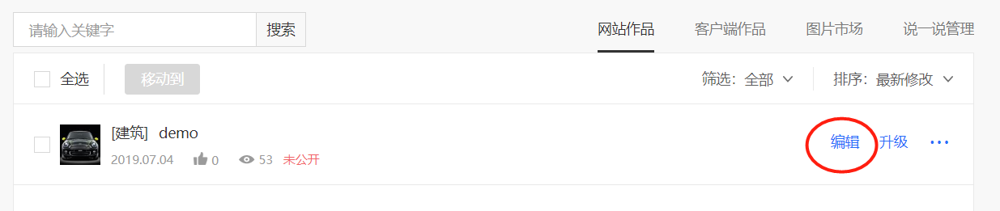
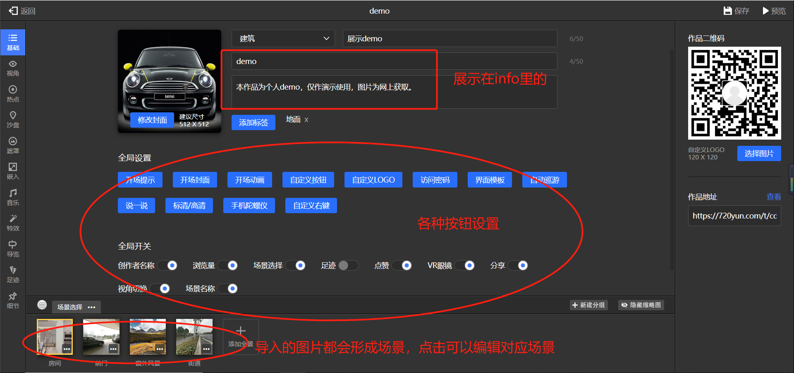

---
tags:
- 全景
abstract: 本文讲如何利用720云做全景展示
---

# 利用720云做全景展示

<TagGroup/>

最近因为朋友有做全景的单子，勾起了我的好奇心，就研究了一下。

下面是我做的一个demo :laughing:，感觉很容易上手，适合大家把玩。

[练手做的demo](https://720yun.com/t/cdvknyiqpre)

> 图片来源于网络，仅作学习联系使用

好了，下面就来说说如何制作这样有趣的全景展示。

## 1.注册登录720yun账号

首先到 [720yun](https://720yun.com/find) 注册一个账号并登录，有免费版和专业版，免费版已经能够满足我们的初步尝试需求。

## 2.上传图片

在制作全景展示之前，大家需要准备几张 `2:1` 的 `jpg` 全景图片（练手可上网查找）。如该图 

登录720yun网站点击上传按钮跳转上传页面，从本地添加全景（可在一个作品里添加多张图片作为转场场景）。

填写完整项目信息并点击上传，然后到作品管理页面即可点击分享查看制作好的全景了。

## 3.编辑全景

初始的全景展示并没有酷炫的效果，需要我们对作品进行编辑，点击编辑按钮进入奇妙之旅吧！

- 基础设置

- 视角设置

    可设置对应场景的初始视角

- 热点设置

    最好用的设置，调整到要添加热点的场景及对应视角，点击添加热点，即可选择对应的系统图标、热点类型等。

    > 热点类型选择全景切换即可在用户点击热点时跳转到对应场景，且可设置场景切换效果，如淡入淡出、缩放过渡等。

- 其他功能

    在跟着上面步骤走一遍之后，大家应该就能制作出我的demo展示的全景了。当然，剩下的其他功能也很强大，我就不一一介绍了。大家自己慢慢体会。

<Gitalk/>