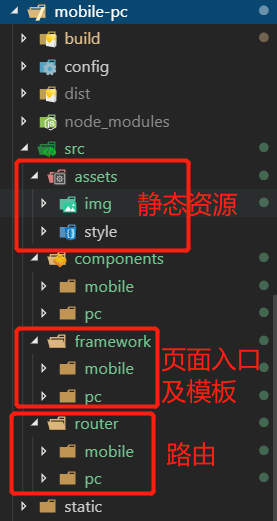
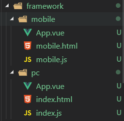
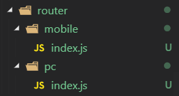
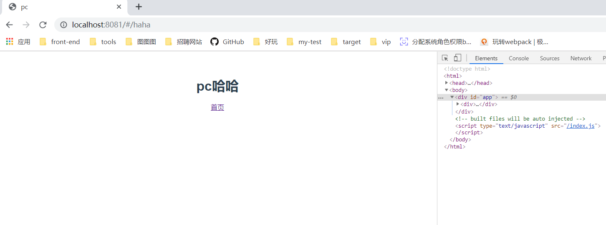
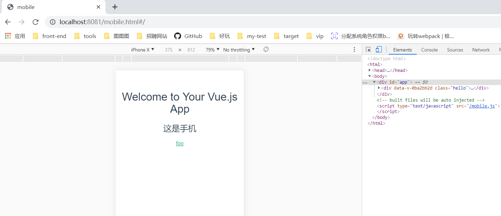

---
tags:
- vue
abstract: 本文讲如何用 vue 实现一个项目中移动端和PC端的切换
---

# vue 实现移动端和PC端切换

<TagGroup/>

最近朋友有提到如果要在一个项目中分别用不同的文件夹放移动端和PC端的代码，如何实现在同一个服务器上判断用户设备并展示对应页面。

在网上找了一下其他开发者的实现方案，发现一个比较好用的：[vue.js实现移动端和PC端切换，超详细](https://blog.csdn.net/ZFL_123456/article/details/86651316)

未防止以后找不到，所以写下本文记录下来自己对这篇博客思路的实践过程。

戳这里可以查看该实践[实践demo](https://howaboutryze.github.io/mobile-pc)

## 1.准备工作

- 依赖：vue-cli 2.x

- 创建项目：`vue init webpack mobile-pc`

- 目录：

    

## 2.修改配置文件

先说说我们要修改哪几个文件以及这几个文件的作用，都在build文件夹下：

1. utils.js
    - 计算资源文件存放路径
    - 生成cssLoaders用于加载 .vue文件中的样式
    - 生成styleLoaders用于加载不在 .vue文件中的单独存在的样式文件
2. webpack.base.conf.js
    - 配置webpack编译入口
    - 配置webpack输出路径和命名规则
    - 配置模块resolve规则
3. webpack.dev.conf.js
    - 将webpack的热重载客户端代码添加到每个entry对应的应用
    - 合并基础的webpack配置
    - 配置样式文件的处理规则，styleLoaders
    - 配置Source Maps
    - 配置webpack插件
4. webpack.pro.conf.js
    - 合并基础的webpack配置
    - 配置样式文件的处理规则，styleLoaders
    - 配置webpack的输出
    - 配置webpack插件
    - gzip模式下的webpack插件配置
    - webpack-bundle分析

``` js
// utils.js

// Generate loaders for standalone style files (outside of .vue)
exports.styleLoaders = function (options) {
  const output = []
  const loaders = exports.cssLoaders(options)

  for (const extension in loaders) {
    const loader = loaders[extension]
    output.push({
      test: new RegExp('\\.' + extension + '$'),
      use: loader
    })
  }

  return output
}

/**
 * 开始添加
 * @returns {Function}
 */
// glob 是webpack安装时依赖的一个第三方模块，该模块允许你使用*等符号，例如lib/*.js就是获取lib文件夹下的所有js后缀名的文件
var glob = require('glob')
// 页面模板
var HtmlWebpackPlugin = require('html-webpack-plugin')
// 取得相应的页面路径，因为之前的目录结构，所以是src文件下的framework文件夹
var PAGE_PATH = path.resolve(__dirname, '../src/framework')
// 用于做相应的merge处理
var merge = require('webpack-merge')

// 多入口配置
// 通过glob模块读取framework文件夹下的js后缀文件，如果该文件存在
// 那么就作为入口处理
exports.entries = function () {
  var entryFiles = glob.sync(PAGE_PATH + '/*/*.js')
  var map = {}
  entryFiles.forEach((filePath) => {
    var filename = filePath.substring(filePath.lastIndexOf('\/') + 1, filePath.lastIndexOf('.'))
    map[filename] = filePath
  })
  return map
}

// 多页面输出配置
// 与上面的多页面入口配置相同，读取framework文件夹下对应的html后缀文件，然后放入数组中
exports.htmlPlugin = function () {
  let entryHtml = glob.sync(PAGE_PATH + '/*/*.html')
  let arr = []
  entryHtml.forEach((filePath) => {
    let filename = filePath.substring(filePath.lastIndexOf('\/') + 1, filePath.lastIndexOf('.'))
    let conf = {
      // 模板来源
      template: filePath,
      // 文件名称
      filename: filename + '.html',
      // 页面模板需要加对应的js脚本，如果不加这行则每个页面都会引入所有的js脚本
      chunks: ['manifest', 'vendor', filename],
      inject: true
    }
    if (process.env.NODE_ENV === 'production') {
      conf = merge(conf, {
        minfy: {
          removeComments: true,
          collapseWhitespace: true,
          removeAttributeQuotes: true
        },
        chunksSortMode: 'dependency'
      })
    }
    arr.push(new HtmlWebpackPlugin(conf))
  })
  return arr
}
/**
 * 结束添加
 * @returns {Function}
 */

exports.createNotifierCallback = () => {
  const notifier = require('node-notifier')

  return (severity, errors) => {
    if (severity !== 'error') return

    const error = errors[0]
    const filename = error.file && error.file.split('!').pop()

    notifier.notify({
      title: packageConfig.name,
      message: severity + ': ' + error.name,
      subtitle: filename || '',
      icon: path.join(__dirname, 'logo.png')
    })
  }
}
```

``` js
// webpack.base.conf.js

module.exports = {
  context: path.resolve(__dirname, '../'),
  /**
   * webpack入口文件
   */
  // 注释掉原入口代码
  // entry: {
  //   app: './src/main.js'
  // }
  // 修改开始
  entry: utils.entries(),
  // 修改结束
  output: {
    path: config.build.assetsRoot,
    filename: '[name].js',
    publicPath: process.env.NODE_ENV === 'production'
      ? config.build.assetsPublicPath
      : config.dev.assetsPublicPath
  },
  resolve: {
    extensions: ['.js', '.vue', '.json'],
    alias: {
      'vue$': 'vue/dist/vue.esm.js',
      '@': resolve('src'),
    }
  },
```

``` js
// webpack.dev.conf.js

  plugins: [
    new webpack.DefinePlugin({
      'process.env': require('../config/dev.env')
    }),
    new webpack.HotModuleReplacementPlugin(),
    new webpack.NamedModulesPlugin(), // HMR shows correct file names in console on update.
    new webpack.NoEmitOnErrorsPlugin(),
    // https://github.com/ampedandwired/html-webpack-plugin
    // 自动将依赖注入到html模板中，并输出最终的html文件到目标文件夹
    /**
     * 注释下面这一块
     */
    // new HtmlWebpackPlugin({
    //   filename: 'index.html',
    //   template: 'index.html',
    //   inject: true
    // }),
    /**
     * 注释结束
     */
    // copy custom static assets
    new CopyWebpackPlugin([
      {
        from: path.resolve(__dirname, '../static'),
        to: config.dev.assetsSubDirectory,
        ignore: ['.*']
      }
    ])

    /**
     * 添加 .concat(utils.htmlPlugin())  将原来的模板改为在 utils 中配置的多模板
     */
  ].concat(utils.htmlPlugin())
```

``` js
// webpack.prod.conf.js
    /**
     * 注释下面这块代码块，修改模板
     */
    // new HtmlWebpackPlugin({
    //   filename: config.build.index,
    //   template: 'index.html',
    //   inject: true,
    //   minify: {
    //     removeComments: true,
    //     collapseWhitespace: true,
    //     removeAttributeQuotes: true
    //     // more options:
    //     // https://github.com/kangax/html-minifier#options-quick-reference
    //   },
    //   // necessary to consistently work with multiple chunks via CommonsChunkPlugin
    //   chunksSortMode: 'dependency'
    // }),
    /**
     * 注释结束
     */
    // keep module.id stable when vendor modules does not change
    new webpack.HashedModuleIdsPlugin(),
    // enable scope hoisting
    new webpack.optimize.ModuleConcatenationPlugin(),
    // split vendor js into its own file
    new webpack.optimize.CommonsChunkPlugin({
      name: 'vendor',
      minChunks (module) {
        // any required modules inside node_modules are extracted to vendor
        return (
          module.resource &&
          /\.js$/.test(module.resource) &&
          module.resource.indexOf(
            path.join(__dirname, '../node_modules')
          ) === 0
        )
      }
    }),
    // extract webpack runtime and module manifest to its own file in order to
    // prevent vendor hash from being updated whenever app bundle is updated
    new webpack.optimize.CommonsChunkPlugin({
      name: 'manifest',
      minChunks: Infinity
    }),
    // This instance extracts shared chunks from code splitted chunks and bundles them
    // in a separate chunk, similar to the vendor chunk
    // see: https://webpack.js.org/plugins/commons-chunk-plugin/#extra-async-commons-chunk
    new webpack.optimize.CommonsChunkPlugin({
      name: 'app',
      async: 'vendor-async',
      children: true,
      minChunks: 3
    }),

    // copy custom static assets
    new CopyWebpackPlugin([
      {
        from: path.resolve(__dirname, '../static'),
        to: config.build.assetsSubDirectory,
        ignore: ['.*']
      }
    ])

    /**
     * 添加 .concat(utils.htmlPlugin())   将原来的模板改为在 utils 中配置的多模板
     */
  ].concat(utils.htmlPlugin())
})

```

以上为多页面的 `webpack` 配置。

## 3.设置多页面入口

在 vue-cli 新建的项目中，入口文件为 `index.html 模板`、`main.js 项目主入口`、`App.vue 组件入口`，以此形成了单页面应用。

由此可知，有多少个页面，就需要多少份入口文件。



可以把脚手架生成的三个文件复制到molie和PC文件夹下就行，然后修改一下文件名即可。
注意：
1. 在mobile文件夹下的 `mobile.html` 文件中，把原本的<meta name="viewport" content="width=device-width,initial-scale=1.0"> 替换为<meta name="viewport" content="width=device-width,initial-scale=1.0,minimum-scale=1.0,maximum-scale=1.0,user-scalable=no">
2. 这里的 `mobile.js` 和 `index.js` 中的路由的路径应该选择与自己相对应的路径
3. PC端的模板使用 `index.html` 文件名，这样设置默认加载pc端页面

## 4.配置路由



PC端和移动端要有各自的路由

为了能使PC和移动端切换时自动识别设备类型，我们加一个简单的判断

``` js
// @/router/pc/index.js
import Vue from 'vue'
import Router from 'vue-router'
import HelloWorld from '@/components/pc/HelloWorld'
import Haha from '@/components/pc/Haha'

Vue.use(Router)

let router = new Router({
  routes: [
    {
      path: '/',
      name: 'HelloWorld',
      component: HelloWorld
    },
    {
      path: '/haha',
      name: 'Haha',
      component: Haha
    }
  ]
})

/**
 * 判断是否为移动设备，是，则跳转到移动端的路径
 */
router.beforeEach((to, from, next) => {
  if (/Android|webOS|iPhone|iPod|BlackBerry/i.test(navigator.userAgent)) {
    window.location.href = '/mobile.html#/'
    return
  }
  next()
})

export default router
```

``` js
// @/router/mobile/index.js
import Vue from 'vue'
import Router from 'vue-router'
import HelloWorld from '@/components/mobile/HelloWorld'
import Foo from '@/components/mobile/Foo'

Vue.use(Router)

let router = new Router({
  routes: [
    {
      path: '/',
      name: 'HelloWorld',
      component: HelloWorld
    },
    {
      path: '/foo',
      name: 'Foo',
      component: Foo
    }
  ]
})

/**
 * 验证
 */
router.beforeEach((to, from, next) => {
  if (!/Android|webOS|iPhone|iPod|BlackBerry/i.test(navigator.userAgent)) {
    window.location.href = '/#/'
    return
  }
  next()
})

export default router
```

## 5.查看效果

到了这个时候就可以 `npm start` 运行项目查看效果了



浏览器选择手机模式，刷新页面或跳转路由，即可触发路由守卫，显示移动端页面



## 6.去掉 `url` 中的 `.html` 和 `#`

别说了，将 `vue-router` 改为 `history` 模式即可。 :ghost:

::: tip
想看demo请点击 [这里](https://github.com/HowAboutRyze/mobile-pc)
:::

<Gitalk/>