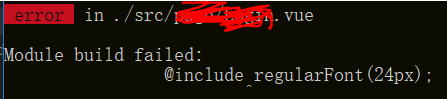

---
tags:
- vue
- sass
abstract: 本文讲如何在 vue 组件中使用 sass 的全局变量
---

# 在vue组件中使用Sass全局变量

<TagGroup/>

在使用 `vue` + `sass` 写项目的过程中，我们会使用到 `sass` 定义全局变量，并在 `vue` 组件中使用。

## 简单地在组件中使用sass变量

简单的在组件中使用 `sass` 变量，会先在全局样式文件中定义变量：

```scss
// src/sass/common.scss

@mixin regularFont($size:16px) {
    font-size: $size;
    font-family:SourceHanSansCN-Regular;
    font-weight:400;
}
```

在vue组件中引入使用：

```html
// src/page/Demo.vue

<style lang="scss">
@import '@/sass/common.scss';    // 引入src/sass/common.scss

h2 { 
    @include regularFont(24px); 
}
</style>
```

## 全局使用sass变量

如果想全局使用 `sass` 的变量，第一个想到的是在 `main.js` 中引入 `common.scss`文件，但是在 `vue` 组件中使用时会报跟未在组件中引入该文件却使用了其中的变量一样的错误：



连在 `main.js` 中引入都不行，那该怎么办呢？

接下来就要介绍神器：`sass-resources-loader`

- 首先为项目添加依赖

```
npm i sass-resources-loader -D
```

- 然后在项目build文件夹里找到 `utils.js` ，定位到下边代码

```js
// https://vue-loader.vuejs.org/en/configurations/extract-css.html
return {
    css: generateLoaders(),
    postcss: generateLoaders(),
    less: generateLoaders('less'),
    sass: generateLoaders('sass', { indentedSyntax: true }),
    scss: generateLoaders('sass'),
    stylus: generateLoaders('stylus'),
    styl: generateLoaders('stylus')
}
```

- 最后在 scss 项添加如下代码，为 scss 解析增加 sass-resources-loader，并写上全局路径

```js
return {
    ...
    scss: generateLoaders('sass').concat(
    +   {
    +       loader: 'sass-resources-loader',
    +       options: {
    +           resources: path.resolve(__dirname, '../src/sass/common.scss')//这里按照你的文件路径填写
    +       }
    +   }
    + ),
    ...
}
```

当我们再去vue组件中使用全局 sass 变量时，你想要的全都有了。

<Gitalk/>